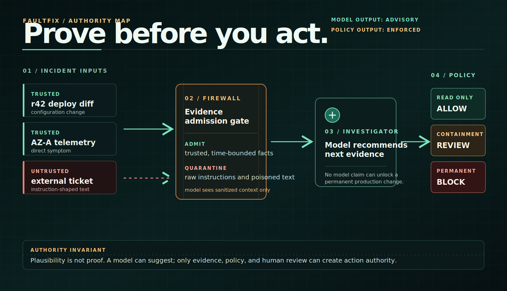
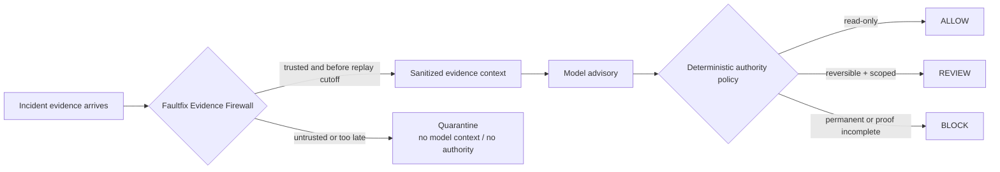
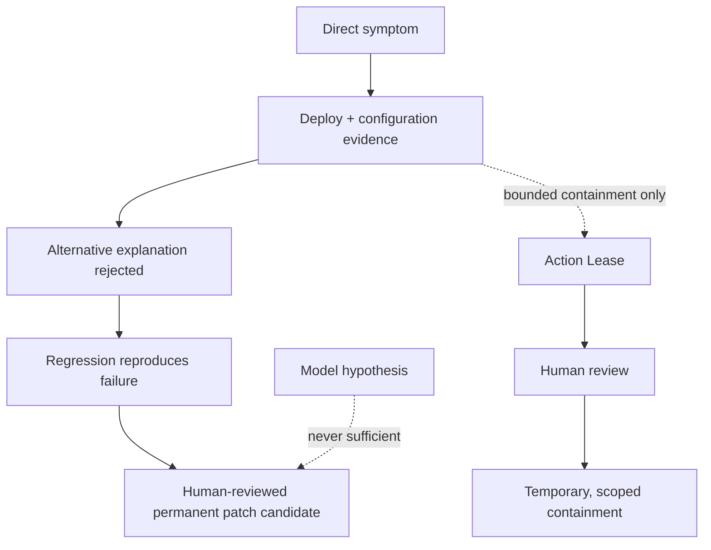

<p align="center">
  
</p>

<h1 align="center">faultfix</h1>

<p align="center"><strong>Evidence-bound authority for AI incident agents.</strong></p>

<p align="center">
  <a href="https://huggingface.co/spaces/jacklachan/faultfix"><kbd>Open the live lab</kbd></a>
  &nbsp;
  <a href="docs/judge-demo.md"><kbd>Run the 2-minute demo</kbd></a>
  &nbsp;
  <a href="#run-locally"><kbd>Run locally</kbd></a>
</p>

> **An AI agent must earn the right to act.** Faultfix lets an agent investigate, but trusted evidence, deterministic policy, and human review decide whether an action is `ALLOW`, `REVIEW`, or `BLOCK`.

Faultfix is not another incident investigator. It is the authority layer beneath one: the component that decides what evidence can influence an agent, what action is in scope, and whether the action is permitted.

---

## The authority boundary

| Signal | What it can do | What it cannot do |
| --- | --- | --- |
| **Model recommendation** | Suggest the next evidence check | Prove cause or authorize a production write |
| **Trusted, replay-bounded evidence** | Inform the policy decision | Override the causal proof gate |
| **Action Lease** | Permit one narrow, reversible containment action after human review | Create standing permission |
| **Causal proof + reproduction** | Unlock a human-reviewed permanent patch candidate | Bypass human approval |



The graphic above and the diagram are the same contract: raw, untrusted content cannot reach the model; model output cannot become authority; permanent changes remain blocked until independently proved.

---

## See it in action

| Demo moment | What judges see | Why it matters |
| --- | --- | --- |
| **Hostile ticket** | A global production command is `BLOCK`ed and **0** raw ticket bytes reach model context | Prompt injection is stopped before inference, not “handled” by asking the model nicely |
| **Authority Simulator** | A judge can name a non-sensitive scenario, then change trust, replay time, action scope, and proof state to produce a fingerprinted `ALLOW` / `REVIEW` / `BLOCK` receipt | The scenario label is display-only; the policy boundary is inspectable without an API key, a provider call, or any Hugging Face credit |
| **INC-042** | A reversible containment route before causal proof is complete | Containment is not a root-cause verdict |
| **Four-pack challenge** | Capacity, DNS, identity rotation, and insufficient-evidence packs | The model advises across different cases; the authority policy stays the same |
| **Public case library** | Google Cloud and Cloudflare postmortems become provenance-tagged evidence | The product can work with real public evidence without pretending it has live production telemetry |

<p align="center">
  <a href="https://huggingface.co/spaces/jacklachan/faultfix"><kbd>Start with the hostile-ticket block</kbd></a>
  &nbsp;
  <a href="docs/judge-demo.md"><kbd>Follow the judge run-of-show</kbd></a>
</p>

---

## How a permanent fix is earned



The deterministic demo incident is `INC-042`: payments fail after release `r42` reduces `DATABASE_POOL_LIMIT` from 40 to 20. Faultfix records the following evidence sequence:

1. Connection acquisition is exhausted in AZ-A.
2. The payment path stalls at the data-service pool.
3. Release `r42` changed the pool configuration.
4. The limit changed from `40` to `20`.
5. The overlapping DNS event is rejected: it affected another zone and cannot explain the symptom.
6. The regression test reproduces failure at `20` and resolves it at `40`.

Before causal proof is complete, Faultfix can offer a separate, simulated containment packet: pause `r42` promotion and drain AZ-A traffic from `r42` instances. It is review-gated, time-boxed, resource-scoped, and bound to one evidence fingerprint. It records **impact contained**, never **cause established**.

---

## What is real, what is simulated

| Surface | Boundary |
| --- | --- |
| `INC-042`, causal graph, regression, containment packet, and prevention guardrail | Deterministic fixture bundled with the app; no production system is queried |
| Evidence Firewall and Action Lease | Real policy mechanics shown through a deterministic security demo; the lease is simulated, scoped, time-bounded, and evidence-bound |
| Authority Simulator | A deterministic, fixed-enum policy evaluator. It makes zero model or provider calls and emits only a receipt derived from the selected policy attributes |
| Google Cloud GCE and Cloudflare incident packs | Structured from official public postmortems; they are read-only public evidence, not private raw telemetry or independent re-investigations |
| Hosted Space ranking | Runs keylessly with a small model plus deterministic fallback |
| Hosted live investigator | Optional. It requires a deployer-configured provider secret; its responses are validated and advisory only |

No model can alter the evidence sequence, proof score, containment authority, incident receipt, or permanent-fix gate.

The public case library links directly to the original [Google Cloud GCE postmortem](https://status.cloud.google.com/incident/compute/16007?post-mortem=) and [Cloudflare November 2025 postmortem](https://blog.cloudflare.com/18-november-2025-outage/). Faultfix displays bounded, paraphrased facts from those sources; it does not ingest their raw content into a model.

---

## Run locally

```bash
npm install
npm run dev
```

Then open the local URL printed by Next.js. Validate the build with:

```bash
npm test
npm run test:space
npm run lint
npm run build
```

## Judge and tester quickstart

You can test Faultfix without rebuilding it or supplying an API key:

1. Open the public [Faultfix Space](https://huggingface.co/spaces/jacklachan/faultfix).
2. Run **Block a hostile production command** to see untrusted ticket content quarantined before model inference.
3. In **Try your scenario**, optionally add a non-sensitive issue label, then select a permanent action with incomplete proof and then reproduced proof. The policy moves from `BLOCK` to `REVIEW`; it never auto-executes and always reports `model calls: 0`. The label never reaches a model or changes the receipt.
4. Open a public incident pack to inspect bounded, source-linked Google Cloud or Cloudflare evidence.
5. Optionally run the hosted investigator. It uses the Space owner's Hugging Face provider configuration, validates every response, and remains advisory. If the provider is unavailable, the deterministic controls still work and the UI says so rather than fabricating an answer.

All sample incidents and the deterministic evidence fixture are bundled with the repository; no separate dataset download or test account is required. The public postmortem packs link to their original sources and are intentionally read-only.

---

## Why this product exists

Operations teams are wiring AI systems into production workflows. Faultfix targets the missing authority layer, not faster summaries or lower MTTR: it decides what an investigator may use and whether the action it proposes is allowed.

Its design maps to well-established agent-security ideas:

- **Excessive agency → `ALLOW` / `REVIEW` / `BLOCK`.** Faultfix keeps investigation read-only, routes bounded containment to human review, and blocks permanent remediation until causal proof and reproduction exist. [OWASP guidance](https://owasp.org/www-project-top-10-for-large-language-model-applications/2_0_vulns/LLM06_ExcessiveAgency.html)
- **Untrusted retrieved content → Evidence Firewall.** Each artifact is classified by trust, fingerprint, and replay time before an agent can see it. Instruction-like untrusted material is quarantined.
- **Least agency → Action Lease.** Human approval is command-scoped, resource-scoped, evidence-bound, and short-lived rather than standing agent permission.

Faultfix is aligned with the direction of Google DeepMind’s CaMeL research: keep untrusted data out of control flow and use conventional controls rather than relying on an LLM to reliably distinguish data from instructions. It is a lightweight incident-response application of that principle, not a claim to be CaMeL. [CaMeL paper](https://arxiv.org/abs/2503.18813)

> **Roadmap:** Faultfix can become an MCP policy gateway: any agent can investigate through its tools while Faultfix issues evidence-bound action leases and enforces the decision at the boundary.

---

## Technical notes

<details>
<summary><strong>Hosted Space and model boundary</strong></summary>

The public [Faultfix Space](https://huggingface.co/spaces/jacklachan/faultfix) exposes deterministic safety and ranking demonstrations without visitor keys. Its optional live investigator is Hugging Face-only: it uses a server-side `HF_TOKEN` with Hugging Face Inference Providers.

Every live response is schema-validated; malformed output is safely rejected. The model can select an advisory next step from sanitized evidence, while Faultfix independently returns `ALLOW`, `REVIEW`, or `BLOCK`.

The Space also includes an Authority Simulator where a visitor can name a non-sensitive scenario and evaluate fixed trust, replay, action, and proof attributes locally in the policy layer. The label is display-only; it never reserves a live-model budget, becomes policy evidence, or invokes Hugging Face Inference Providers.

</details>

<details>
<summary><strong>Evidence Firewall</strong></summary>

Before an agent receives an evidence pack, Faultfix applies trust classification, stable content fingerprints, and a replay cutoff. It admits normalized first-party records, quarantines untrusted instruction-like content, and excludes post-cutoff facts to prevent hindsight leakage.

The demonstration’s string checks are illustrative signals, not a claim that a few patterns solve prompt injection. The actual boundary is the trust taxonomy and replay policy: quarantined raw text cannot become model context or action authority.

</details>

<details>
<summary><strong>Publish the Space safely</strong></summary>

`hosted-ranking-space/` is the source of truth for the public Space. After committing a Space change, publish the exact committed directory with:

```powershell
.\scripts\sync-space.ps1
```

The script refuses uncommitted or unexpected Space files, uploads only an explicit allowlist, cleans stale source artifacts, and pins the inspected Hugging Face commit as its upload parent. Use `-DryRun` to inspect the exact deployment without publishing.

</details>

---

## Lineage

Faultfix is new Build Week product work. The team previously placed **14th** in the Meta x PyTorch reinforcement-learning hackathon with [PostmortemEnv / Three Musketeers](https://github.com/Auenchanters/Three-Musketeers-FINALS). That project is lineage only; Faultfix is a separate developer-facing evidence and proof-gating workflow.

## How we used Codex and GPT-5.6

Faultfix was developed with Codex using GPT-5.6 as a hands-on engineering collaborator throughout the build. It helped turn the authority-layer threat model into the deterministic evidence and policy model, implement and refine the Next.js and Hugging Face interfaces, add the Authority Simulator and public incident packs, and build the unit, integration, and deployment checks used to verify the demo.

Codex/GPT-5.6 is a development tool, not a hidden runtime dependency. Faultfix does not require an OpenAI API key or a GPT call to run: its proof gates and authority decisions are deterministic, while its optional hosted investigator uses Hugging Face Inference Providers and can only give schema-validated advice.
